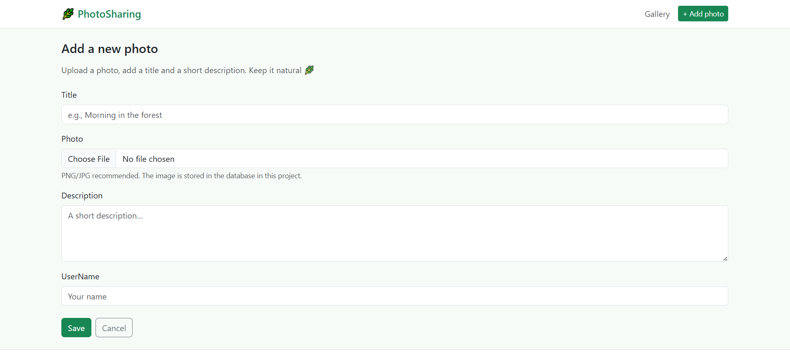

# PhotoSharing (ASP.NET MVC + Entity Framework)

A clean, nature-themed photo gallery built with **ASP.NET MVC 5** and **Entity Framework 6**.
Users can browse photos, open details, and upload new images (stored in the database).

> Portfolio project: focuses on MVC architecture, EF data layer, routing, and a responsive Bootstrap UI.

## Preview

## Features

- 📷 Photo gallery with responsive card layout
- 🔎 Search (title / username / description)
- ↕️ Sorting (latest, oldest, title, user)
- 📄 Pagination
- ➕ Upload photo (stored as bytes in DB)
- 🛡️ Anti-forgery protection on POST forms
- 🧱 MVC architecture with EF data access (Context interface for testability)

## Tech Stack

- ASP.NET MVC 5 (.NET Framework 4.8)
- Entity Framework 6 (Code First)
- SQL Server / LocalDB
- Bootstrap 5 (CDN)

## Routes (important)

This project uses **attribute routing** with the prefix `photos`.

Main routes:
- `GET /photos` → gallery
- `GET /photos/create` → create form
- `POST /photos/create` → create action
- `GET /photos/{id}` → photo details
- `GET /photos/{id}/image` → serves image bytes
- `GET /photos/{id}/delete` → delete confirmation
- `POST /photos/{id}/delete` → delete action

➡️ More details in: [docs/ROUTES.md](docs/ROUTES.md)

## Getting Started (Local)

### Prerequisites
- Visual Studio 2022 (or 2019) with ASP.NET / web workload
- SQL Server LocalDB (recommended) or SQL Server Express

### Setup
1. Clone the repo and open the solution:
   - `PhotoSharingApplication.sln`

2. Restore NuGet packages:
   - Visual Studio will usually prompt automatically
   - Or: right-click Solution → **Restore NuGet Packages**

3. Configure database connection (Web.config)

Open `Web.config` and set the connection string `PhotoSharingContext`.

Example LocalDB:

<add name="PhotoSharingContext"
     connectionString="Data Source=(localdb)\MSSQLLocalDB;Initial Catalog=PhotoSharingDb;Integrated Security=True"
     providerName="System.Data.SqlClient" />

### Apply migrations (Package Manager Console)

in powershell:
Update-Database -Verbose

### Run (IIS Express)

Open: `http://localhost:<port>/photos`

---

## Notes / Limitations

- Images are stored in the database as `byte[]`.  
  (Great for learning/demo; in production you’d typically store files in blob storage + CDN.)
- You may see NuGet security warnings (older dependencies).  
  The UI uses Bootstrap 5 via CDN, but dependency upgrades can be done later.

---

## What I Learned

- Structuring an ASP.NET MVC app (controllers, views, models)
- EF Code First: context, migrations, and seeding
- Attribute routing and clean endpoints
- Serving images from DB through an MVC endpoint
- Improving UI/UX using partial views and Bootstrap
